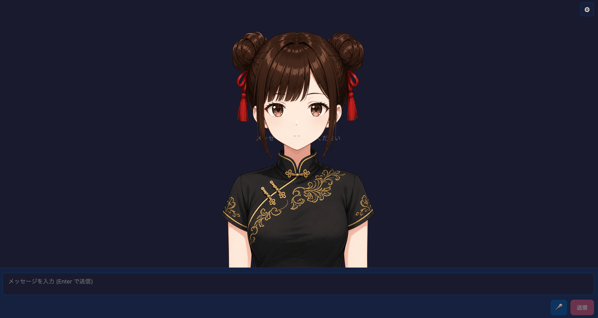
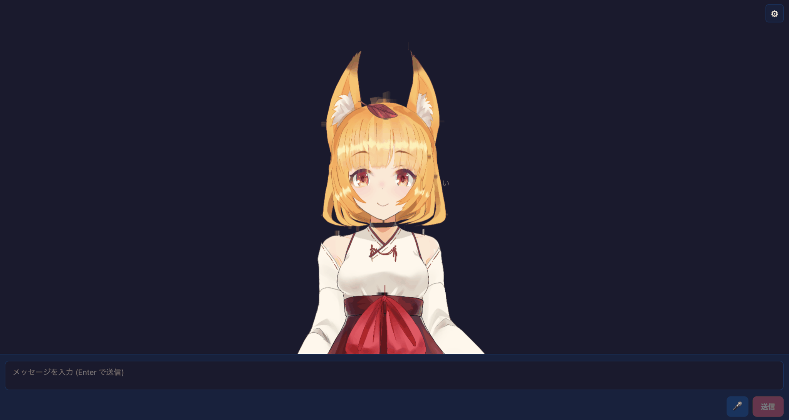
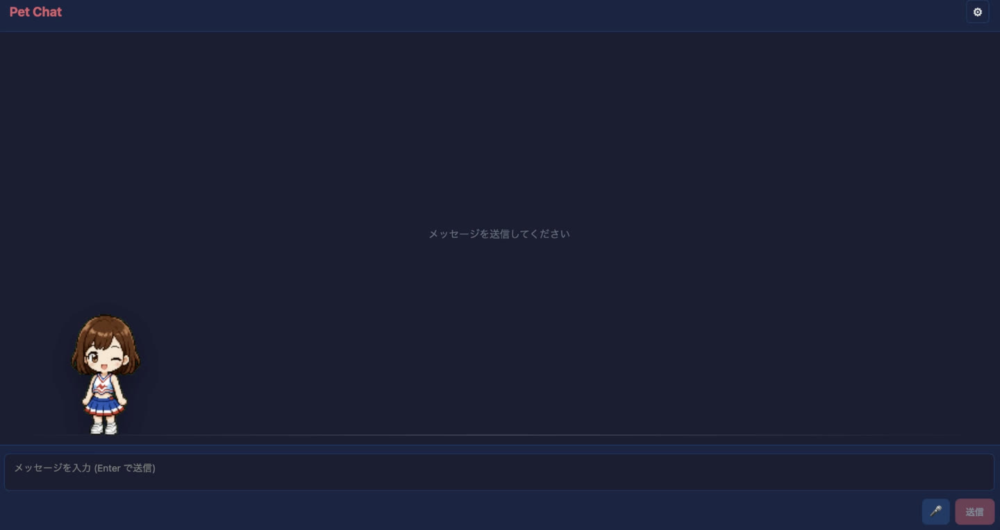
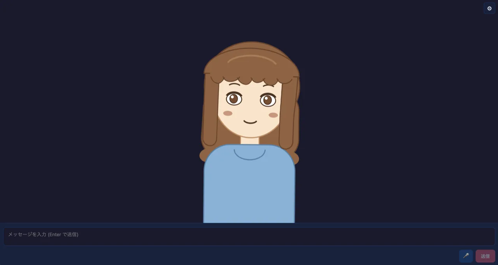

# サンプル一覧

[English version](./examples.md)

<p align="center">
  
</p>

AITuber OnAir には、フル機能のアプリサンプルと、より小さなパッケージ別
サンプルがあります。初めて使う場合は、まずフル機能の AI VTuber アプリを
1つ動かし、その後で必要に応じてパッケージ別サンプルを確認してください。

## おすすめの始め方

- 初めての AITuber OnAir プロジェクトなら
  [`packages/core/examples/react-pngtuber-app`](../packages/core/examples/react-pngtuber-app)
  から始めてください。
- 3D アバターを使いたい場合は
  [`packages/core/examples/react-vrm-app`](../packages/core/examples/react-vrm-app)
  を使います。
- FBX キャラクターとモーションクリップを持っている場合は
  [`packages/core/examples/react-fbx-app`](../packages/core/examples/react-fbx-app)
  を使います。
- 小さなアニメーション Pet をチャット状態に反応させたい場合は
  [`packages/core/examples/react-pet-app`](../packages/core/examples/react-pet-app)
  を使います。
- すでに Live2D モデルアセットを持っている場合は
  [`packages/core/examples/react-live2d-app`](../packages/core/examples/react-live2d-app)
  を使います。
- トラッキングや 3D アセットなしで、よく動く 2D アバターを使いたい場合は
  [`packages/core/examples/react-purupuru-app`](../packages/core/examples/react-purupuru-app)
  を使います。
- 実験的な Inochi2D アバター（ビルド済みランタイム）を試したい場合は
  [`packages/core/examples/react-inochi2d-app`](../packages/core/examples/react-inochi2d-app)
  を使います。
- 1つの PSD ファイルから PSDTool 風または Anime2.5DRig 互換の 2D 立ち絵
  アバターを使いたい場合は
  [`packages/core/examples/react-psd-app`](../packages/core/examples/react-psd-app)
  を使います。
- 既存アプリにチャット、音声、メモリ、配信連携を組み込みたい場合は、
  パッケージ別サンプルを参照してください。

## フル機能の AI VTuber アプリ

### PNGTuber App

<p align="center">
  
</p>

パス:
[`packages/core/examples/react-pngtuber-app`](../packages/core/examples/react-pngtuber-app)

最初のローカルセットアップに向いています。2D PNG のアバター状態を使い、
実際の音声出力ボリュームからリップシンクを駆動します。

```bash
cd packages/core/examples/react-pngtuber-app
npm install
npm run dev
```

### ぷるぷるPNGTuber App

<p align="center">
  
</p>

パス:
[`packages/core/examples/react-purupuru-app`](../packages/core/examples/react-purupuru-app)

トラッキングや 3D アセットを用意せずに、よく動く 2D アバターを使いたい場合に
最適です。`.purupuru` 形式のアバターパッケージ（1ファイル）を読み込み、
アイドルモーション・まばたき・音声リップシンク・髪のバネ物理・振り向き・
感情リアクションを駆動します。AITuber OnAir 公式キャラクター「ミコ」を
デフォルトアバターとして同梱しています。`.purupuru` アバター形式は
rotejin さんが開発された [ぷるぷるPNGTuber](https://github.com/rotejin/PuruPuruPNGTuber)
によるもので、このサンプルはその AITuber 向け移植です。

```bash
cd packages/core/examples/react-purupuru-app
npm install
npm run dev
```

### Inochi2D App（実験的）

<p align="center">
  
</p>

パス:
[`packages/core/examples/react-inochi2d-app`](../packages/core/examples/react-inochi2d-app)

Inochi2D アバターを試したい場合に向いています。ビルド済みの Inochi2D
ランタイムを使って Inochi2D モデルを WebGL ステージに描画し、音声出力
ボリュームから口元を動かします。初回表示用に Aka Inochi2D モデルを同梱しています。
ローカルの `.inx` / `.inp` ファイルを読み込むか、`public/inochi2d/manifest.json`
に別モデルを登録することもできます。

```bash
cd packages/core/examples/react-inochi2d-app
npm install
npm run dev
```

### Pet App

<p align="center">
  
</p>

パス:
[`packages/core/examples/react-pet-app`](../packages/core/examples/react-pet-app)

軽量なアニメーション companion を使いたい場合に向いています。Codex Pet 互換
スプライトシートを描画し、チャット状態、応答の雰囲気、実際の音声出力
ボリュームに応じて Pet がステージ内を動きます。

```bash
cd packages/core/examples/react-pet-app
npm install
npm run dev
```

### VRM App

<p align="center">
  
</p>

パス:
[`packages/core/examples/react-vrm-app`](../packages/core/examples/react-vrm-app)

3D アバタープロジェクトに向いています。VRM モデルを描画し、任意の
アイドル VRMA アニメーションとカメラ操作に対応しています。

```bash
cd packages/core/examples/react-vrm-app
npm install
npm run dev
```

### FBX App

パス:
[`packages/core/examples/react-fbx-app`](../packages/core/examples/react-fbx-app)

FBX キャラクターリグをすでに持っている場合に向いています。
`avatar.fbx` を読み込み、任意の `idle.fbx` と `talk.fbx` を合成し、
音声出力ボリュームから口元または顎の動きを駆動します。発話中は
screenplay 感情タグに合う表情モーフも合成します。

```bash
cd packages/core/examples/react-fbx-app
npm install
npm run dev
```

### Live2D App

<p align="center">
  
</p>

<p align="center">
  <small>
    Live2D サンプルモデル: 桃瀬ひより。イラスト: かにビーム、
    モデリング: Live2D Inc. このコンテンツは Live2D Inc. が著作権を
    有するサンプルデータを使用しています。詳細:
    <a href="https://www.live2d.com/learn/sample/">Live2D サンプルデータ集</a>。
  </small>
</p>

パス:
[`packages/core/examples/react-live2d-app`](../packages/core/examples/react-live2d-app)

すでに Live2D アセットを持っている場合に向いています。ローカルの Live2D
モデルフォルダを読み込み、音声出力ボリュームから口元を動かします。
Live2D モデルアセットは同梱していません。

```bash
cd packages/core/examples/react-live2d-app
npm install
npm run dev
```

### PSD 立ち絵 App

<p align="center">
  
</p>

パス:
[`packages/core/examples/react-psd-app`](../packages/core/examples/react-psd-app)

1つの PSD ファイルから PSDTool 風または Anime2.5DRig 互換の 2D 立ち絵
アバターを読み込みたい場合に向いています。PSD レイヤーを canvas に合成し、
口・目レイヤーをリップシンクやまばたきで動かします。追加設定なしで動く
motion sample も同梱しています。

```bash
cd packages/core/examples/react-psd-app
npm install
npm run dev
```

## Core サンプル

- [`packages/core/examples/react-basic`](../packages/core/examples/react-basic):
  複数 LLM プロバイダー、TTS エンジン、ツール呼び出し、MCP、画像チャット
  に対応した React チャット統合。
- [`packages/core/examples/coding-agent`](../packages/core/examples/coding-agent):
  コーディングエージェント風ワークフローで AITuber OnAir Core を使う例。

## Chat サンプル

- [`packages/chat/examples/node-basic`](../packages/chat/examples/node-basic):
  Node.js での基本チャット、プロバイダー別呼び出し、Vision、ツール呼び出し、
  ストリーミングの例。ブラウザから直接呼べないプロバイダーもここから試す
  （現状該当するのは、API がブラウザからの CORS リクエストを許可していない
  Sakana AI Fugu のみ。`sakana-example.js` を利用）。
- [`packages/chat/examples/react-basic`](../packages/chat/examples/react-basic):
  React ブラウザアプリでのチャット利用。ブラウザから直接呼べない
  プロバイダーは無効化して表示している（現状該当するのは Sakana AI のみ）。
  該当プロバイダーは node-basic か自前の backend proxy から試せる。
- [`packages/chat/examples/local-llm-cli`](../packages/chat/examples/local-llm-cli):
  ローカルまたはセルフホストの OpenAI 互換 LLM 向け対話 CLI。
- [`packages/chat/examples/agent-providers`](../packages/chat/examples/agent-providers):
  Codex、Claude、Copilot など Agent SDK ベースの provider 利用例。
  実験的な Codex キャラクターチャット CLI を含む。
- [`packages/chat/examples/character-agent`](../packages/chat/examples/character-agent):
  ツール、JSON ストレージ、テストを備えた秘書風キャラクターエージェント。
- [`packages/chat/examples/compat-probe`](../packages/chat/examples/compat-probe):
  OpenAI 互換チャットエンドポイントの互換性確認。
- [`packages/chat/examples/mock-openai-server`](../packages/chat/examples/mock-openai-server):
  ローカルテスト用の OpenAI 互換モックサーバー。
- [`packages/chat/examples/discord-bot`](../packages/chat/examples/discord-bot):
  Discord Bot サンプル。
- [`packages/chat/examples/slack-bot`](../packages/chat/examples/slack-bot):
  Slack Bot サンプル。
- [`packages/chat/examples/gas-basic`](../packages/chat/examples/gas-basic):
  Google Apps Script のチャットサンプル。OpenAI を使った
  Google Forms → Gmail 下書きレシピを含む。

## Voice サンプル

- [`packages/voice/examples/node-basic`](../packages/voice/examples/node-basic):
  OpenAI 互換音声、VOICEVOX、Aivis Speech、Aivis Cloud、VoicePeak、
  音声再生確認に対応した Node.js TTS 例。
- [`packages/voice/examples/react-basic`](../packages/voice/examples/react-basic):
  エンジン切り替えと provider 別設定に対応した React ブラウザ TTS アプリ。
- [`packages/voice/examples/bun-basic`](../packages/voice/examples/bun-basic):
  Bun ランタイムでの TTS 利用例。
- [`packages/voice/examples/deno-basic`](../packages/voice/examples/deno-basic):
  Deno ランタイムでの TTS 利用例。

## Bushitsu Client サンプル

- [`packages/bushitsu-client/examples/react-basic`](../packages/bushitsu-client/examples/react-basic):
  React での WebSocket チャットクライアント利用。
- [`packages/bushitsu-client/examples/node-basic`](../packages/bushitsu-client/examples/node-basic):
  Node.js での WebSocket チャットクライアント利用。
- [`packages/bushitsu-client/examples/gas-send-only`](../packages/bushitsu-client/examples/gas-send-only):
  Google Apps Script の送信専用サンプル。

## Manneri サンプル

- [`packages/manneri/examples/browser-basic`](../packages/manneri/examples/browser-basic):
  LLM に接続せず会話パターン検出を試せるブラウザサンプル。

## Comment Intelligence サンプル

- [`packages/comment-intelligence/examples/live-comment-filter-sample`](../packages/comment-intelligence/examples/live-comment-filter-sample):
  LLM に送る前にライブコメントをフィルタリングするブラウザサンプル。

## スターターテンプレート

<p align="center">
  
</p>

このモノレポの外にクリーンなプロジェクトを作りたい場合は
`create-aituber-onair` を使います。

```bash
npm create aituber-onair@latest my-aituber
```

CLI には PNGTuber、VRM、Live2D テンプレートが含まれています。
最初の実行手順は [クイックスタート](./quickstart.ja.md) を参照してください。
